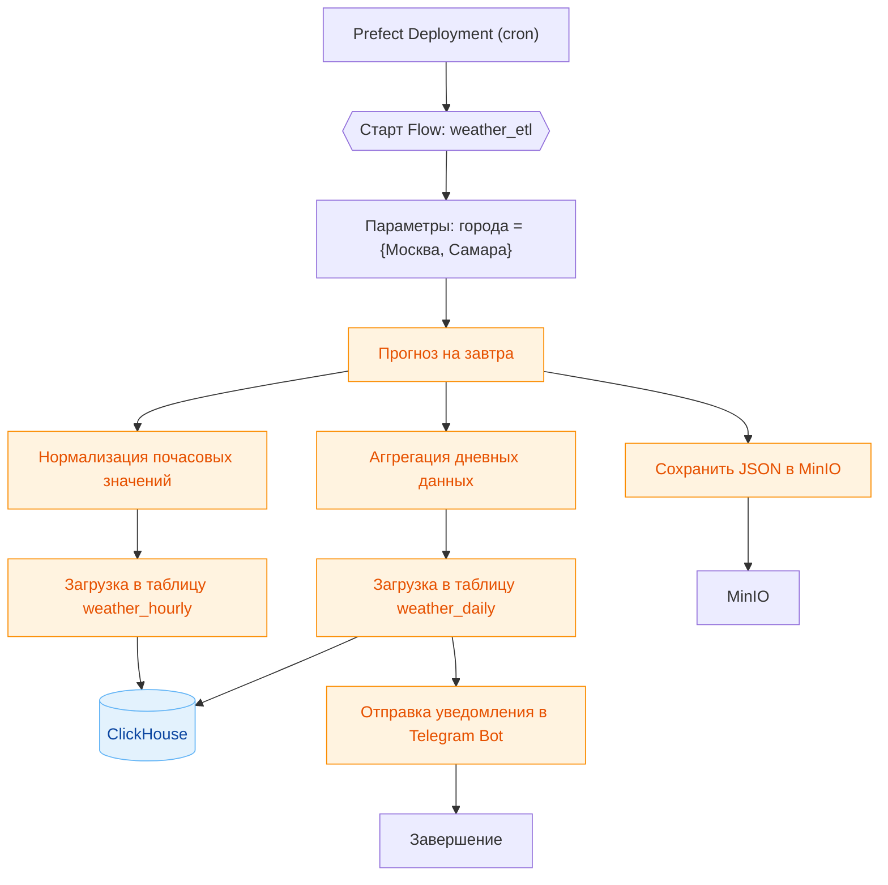

# Задание к лабораторной работе №1

Заданием на лабораторную работу является реализация следующего пайплайна:

1. В качестве источника данных предлагается использовать [Free Weather API](open-meteo.com)
2. `(Extract)` Получить прогноз **на завтра** по переменным: *температура, осадки, скорость и направление ветра* для городов **Самара и Москва**. Сырые ответы API сохранить в объектном хранилище
3. `(Transform)`
    - Извлечь почасовые значения и нормализовать для таблицы `weather_hourly`
    - Посчитать дневную статистику (min, max, avg температуру и количество осадков) и подготовить для сохранения в таблице `weather_daily`
4. `(Load)` Загрузить преобразованные данные в соответствующие таблицы ClickHouse
5. Автоматически отправить уведомления в Telegram с кратким прогнозом на завтра и предупреждать о сильном ветре/осадках
6. **(Опционально)** Реализовать обработку различных ошибок.

## Используемые инструменты

1. `Perfect` - для реализации ETL пайплайна.
2. `MinIO` - для объектного хранилища.
3. `Clickhouse` - для базы данных.

## Ожидаемый результат

Что должно быть в репозитории:
1. Код пайплайна с использованием `Prefect`.
2. Фрагменты кода инициализации таблиц в `Clickhouse`.
3. `Docker Compose` файл описывающий окружение используемое для выполнения работы.
4. Отчет в формате `.pdf`.